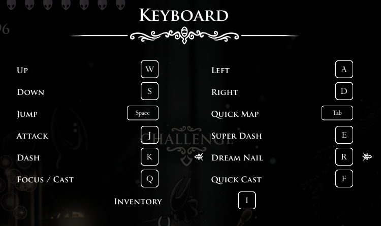
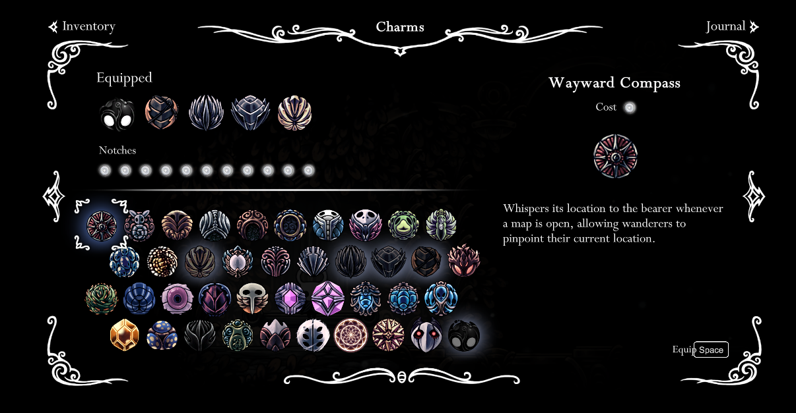

# Playing Hollow Knight with Reinforcement Learning

The project uses Deep Q-Network to learn how to play boss fight in Hollow Knight.

I am currently primarily trying to train the agent with Hornet boss fight, 
but it should be able to run on most Hall of Gods Boss with only one boss health bar.

You need to install the Satchel and EnemyHPBar Mod to correctly run (so it can recognize boss HP), 
I have made some modifications (custom HP bar color) 
for more stable recognition, the mod files can be found in Managed folder.

**Note: I am still updating the project, so any file or structure of the repo may change**

**Note: the "master" branch contains files and algorithms working in progress, "hornet" branch contains a version that was able to train an agent that can defeat hornet most of the time, that branch will no longer be modified unless important updates (e.g. bug fix) is needed**

________________________

## Platform and requirements

Python 3 (tested with Python 3.10) <br>
Windows 10 or 11 <br>
Screen with at least width/height of (1280, 720) resolution (note that this can be modified to smaller resolution in hkenv.py, but then you need to rewrite quite a bit of recognition codes) <br>
CUDA GPU <br>
The newest version of Hollow Knight Game (tested with Steam version) <br>
packages listed in requirements.txt <br>


_________________________

## Usage
run Hollow knight in window mode, make sure use the following keymap settings:
 <br>
Currently, only up, down, left, right, jump, attack are used, so others doesn't matter at this time.

charms I used:


Then, manually walk to one of the Hall of Gods statues, until you see the 'Challenge' prompt, 
run the following from terminal with virtual environment and all required packages installed:

```
python train.py
```

It will take over keyboards to control the game, if you want to force quit in the middle, Ctrl+C in terminal will work. <br>
While running, do not click on other windows, stay focused on the Hollow Knight window, unless you want to stop running

___________________________

## Project Tentative Plan:
- [ ] Update Project Structure
  - [x] Add requirements.txt, mod files
  - [x] Add instructions to train
  - [ ] Add more docstrings and typehint in code
  - [x] Add a simple sanity check that runs gym cartpole
- [ ] Train an agent that can defeat Hornet
- [x] Add code for additional functionalities (like saving buffer, model...)
  - [x] Saving model periodically
  - [x] Tensorboard logging
  - [x] Save/load random agent experiences
  - [x] Add evaluate in trainer
- [ ] Improve the algorithm/model/implementation
  - [x] Frame Stacking
  - [x] Spectral Normalization
  - [x] Huber Loss
  - [x] Double DQN
  - [x] Dueling DQN
  - [x] Multistep return
  - [x] improve reward function (make it denser)
  - [x] Image Augmentation (DrQ)
  - [x] ResNet-like model
  - [x] Squeeze and Excitation based model
  - [x] Noisy Network
  - [x] NAdam Optimizer
  - [x] Reset Training


Project inspired by https://github.com/ailec0623/DQN_HollowKnight <br>
It is a very interesting project, and the author has already defeated Hornet with a trained agent. However, that project uses CE and Windows API heavily, which I am less familiar with, and I also want to practice with extensions on dqn, so I decided to write one from scratch on my own.

_______________________________

## Changes
- Use Huber Loss instead of MSE
- Add Spectral Normalization in model
- Add Double DQN
- Add Dueling DQN (No gradient rescaling)
- Add no magnitude reward (so all rewards are either 1, 0, or -1)
- Use LeakyReLU instead of ReLU
- Remove Dash, it is way too hard to use
- Add Fixed time for each step
- Rewrite reward function
- Add save/load random explorations
- Reduce learning update frequency
- Add Multistep return
- Add DrQ
- Remove Spectral Normalization
- Add more models
- Add Noisy Network based model
- Use Kornia for augmentation (significantly faster than numpy/torchvision)
- Add Intensity augmentation
- Use NAdam optimizer
- remove non-cuda support to use cuda mix-precision
- Add reset training
- Add Proportional Prioritized experience replay


_______________________________

## Training:
- 12/18/2022: agent stuck in repeating a sequence of actions, and eventually stopped doing anything (no op) most of the time.
- 12/19/2022: significantly reduced learning update frequency, the agent no longer converge to a no op situation, so it appears that the problem was overfitting. My next goal would be addressing sparse reward, multistep return is my first attempt.
- 12/20/2022: The agent defeated Hornet the first time (at evaluation), the winning agent is a saved copy from the episode with the highest training reward. Unfortunately, there is a bug in the environment, leading to infinity reward, and broke the agent later on.
- 12/21/2022: The agent stays in a suboptimal policy that tries to die as fast as possible, likely due to the small negative reward for each step, so I removed it
- 12/22/2022-12/23/2022: focus on improving code, code now takes about 10% less time compared to before
- 12/24/2022: The agent again stays in suboptimal policy
- 12/25/2022: The agent now can defeat Hornet with a decent win rate (6 win out of 10 test episodes with bestmodel), this weight uses AttentionExtractor, model weight can be found [here](https://drive.google.com/drive/folders/1rUxppjU-QrSTvefhu8mclB1gvSWZh-mG?usp=sharing)
- 12/26/2022: I modified the reward function, now the agent knows to chase the boss (at least sometimes), and got 5 win out of 10 test episodes.
- 12/27/2022: tweaked several hyperparameters, the agent won 10/10 test episodes (note that this does not mean it will always win, but it does mean it got better). This weight uses SimpleExtractor, weight can be found [here](https://drive.google.com/drive/folders/1EOlSS6pknAID04wfB2AmB2XZCnuEHWxH?usp=sharing)

_______________________________

## References  (order based on my implementation order)
- [Playing Atari with Deep Reinforcement Learning](https://www.cs.toronto.edu/~vmnih/docs/dqn.pdf)
- [Deep Reinforcement Learning with Double Q-learning](https://arxiv.org/abs/1509.06461)
- [Dueling Network Architectures for Deep Reinforcement Learning](https://arxiv.org/abs/1511.06581)
- [Spectral Normalisation for Deep Reinforcement Learning: an Optimisation Perspective](https://arxiv.org/abs/2105.05246)
- [Rainbow: Combining Improvements in Deep Reinforcement Learning](https://arxiv.org/abs/1710.02298)
- [Image Augmentation Is All You Need: Regularizing Deep Reinforcement Learning from Pixels](https://arxiv.org/abs/2004.13649)
- [Deep Residual Learning for Image Recognition](https://arxiv.org/abs/1512.03385)
- [Squeeze-and-Excitation Networks](https://arxiv.org/abs/1709.01507)
- [A ConvNet for the 2020s](https://arxiv.org/abs/2201.03545)
- [Bag of Tricks for Image Classification with Convolutional Neural Networks](https://arxiv.org/pdf/1812.01187.pdf)
- [Noisy Networks for Exploration](https://arxiv.org/abs/1706.10295)
- [The Primacy Bias in Deep Reinforcement Learning](https://arxiv.org/abs/2205.07802)
- [Prioritized Experience Replay](https://arxiv.org/abs/1511.05952)

- https://github.com/toshikwa/fqf-iqn-qrdqn.pytorch/blob/master/fqf_iqn_qrdqn/network.py
- https://github.com/pytorch/vision/blob/main/torchvision/models/vgg.py
- https://www.youtube.com/watch?v=NP8pXZdU-5U